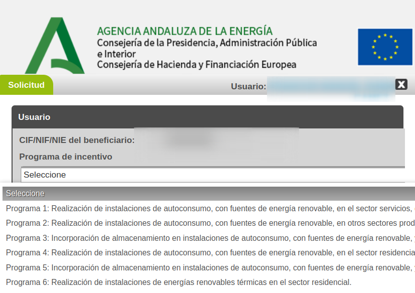
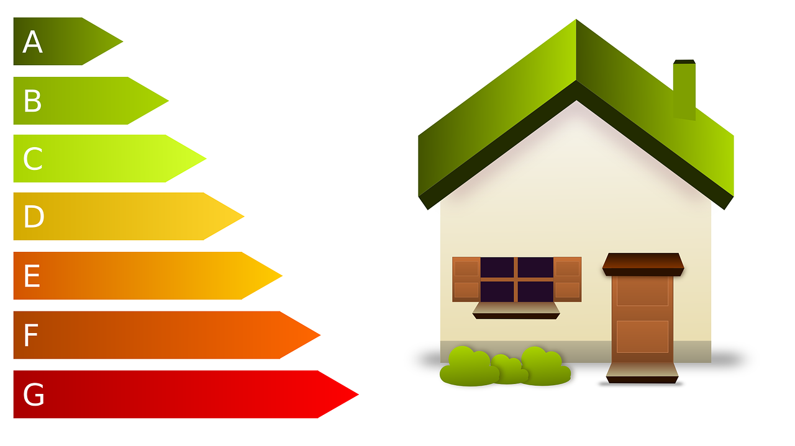

{ width="100"  }

<h1 style="color:Orange;">Incentivos para energías renovables en autoconsumo, almacenamiento y para térmicas en sector residencial </h1>

???+ " Ejemplo: Instala solar fotovoltaica: Ayuda de 2.400€ si invierte 5.500€ [Contáctanos :fontawesome-solid-paper-plane:](Contacto){ .md-button .md-button--primary }"

    { width="300" align=right }
    Hogar medio en el que conviven cuatro personas con un consumo anual estimado de unos 6.000 kWh instala solar fotovoltaica de 4 kW con una inversión de 5.500€. El incentivo que podría corresponderle es de 2.400€ (600 euros por unidad de potencia en instalaciones de hasta 10 kWp). Si esa misma instalación se hiciera de forma colectiva, compartida por varios propietarios, el incentivo subiría a 2.840€ (710 euros por unidad de potencia en instalaciones de hasta 10 kWp).
???+ note

    { width="300" align=left }
    Hogar medio en el que conviven cuatro personas con un consumo anual estimado de unos 6.000 kWh instala solar fotovoltaica de 4 kW con una inversión de 5.500€. El incentivo que podría corresponderle es de 2.400€ (600 euros por unidad de potencia en instalaciones de hasta 10 kWp). Si esa misma instalación se hiciera de forma colectiva, compartida por varios propietarios, el incentivo subiría a 2.840€ (710 euros por unidad de potencia en instalaciones de hasta 10 kWp).
???+ note

    { width="300" align=left }
    Hogar medio en el que conviven cuatro personas con un consumo anual estimado de unos 6.000 kWh instala solar fotovoltaica de 4 kW con una inversión de 5.500€. El incentivo que podría corresponderle es de 2.400€ (600 euros por unidad de potencia en instalaciones de hasta 10 kWp). Si esa misma instalación se hiciera de forma colectiva, compartida por varios propietarios, el incentivo subiría a 2.840€ (710 euros por unidad de potencia en instalaciones de hasta 10 kWp).

???+ note
    { width="300" align=left }

    Hogar medio en el que conviven cuatro personas con un consumo anual estimado de unos 6.000 kWh instala solar fotovoltaica de 4 kW con una inversión de 5.500€. El incentivo que podría corresponderle es de 2.400€ (600 euros por unidad de potencia en instalaciones de hasta 10 kWp). Si esa misma instalación se hiciera de forma colectiva, compartida por varios propietarios, el incentivo subiría a 2.840€ (710 euros por unidad de potencia en instalaciones de hasta 10 kWp).

???+ note

    { width="300" align=right }

    Hogar medio en el que conviven cuatro personas con un consumo anual estimado de unos 6.000 kWh instala solar fotovoltaica de 4 kW con una inversión de 5.500€. El incentivo que podría corresponderle es de 2.400€ (600 euros por unidad de potencia en instalaciones de hasta 10 kWp). Si esa misma instalación se hiciera de forma colectiva, compartida por varios propietarios, el incentivo subiría a 2.840€ (710 euros por unidad de potencia en instalaciones de hasta 10 kWp).

???+ note

    { width="300" align=left }

    Hogar medio en el que conviven cuatro personas con un consumo anual estimado de unos 6.000 kWh instala solar fotovoltaica de 4 kW con una inversión de 5.500€. El incentivo que podría corresponderle es de 2.400€ (600 euros por unidad de potencia en instalaciones de hasta 10 kWp). Si esa misma instalación se hiciera de forma colectiva, compartida por varios propietarios, el incentivo subiría a 2.840€ (710 euros por unidad de potencia en instalaciones de hasta 10 kWp).

???+ note

    { width="300" align=right }

    Hogar medio en el que conviven cuatro personas con un consumo anual estimado de unos 6.000 kWh instala solar fotovoltaica de 4 kW con una inversión de 5.500€. El incentivo que podría corresponderle es de 2.400€ (600 euros por unidad de potencia en instalaciones de hasta 10 kWp). Si esa misma instalación se hiciera de forma colectiva, compartida por varios propietarios, el incentivo subiría a 2.840€ (710 euros por unidad de potencia en instalaciones de hasta 10 kWp).

???+ note

    { width="300" align=left }

    Hogar medio en el que conviven cuatro personas con un consumo anual estimado de unos 6.000 kWh instala solar fotovoltaica de 4 kW con una inversión de 5.500€. El incentivo que podría corresponderle es de 2.400€ (600 euros por unidad de potencia en instalaciones de hasta 10 kWp). Si esa misma instalación se hiciera de forma colectiva, compartida por varios propietarios, el incentivo subiría a 2.840€ (710 euros por unidad de potencia en instalaciones de hasta 10 kWp).

???+ note

    { width="300" align=right }

    Hogar medio en el que conviven cuatro personas con un consumo anual estimado de unos 6.000 kWh instala solar fotovoltaica de 4 kW con una inversión de 5.500€. El incentivo que podría corresponderle es de 2.400€ (600 euros por unidad de potencia en instalaciones de hasta 10 kWp). Si esa misma instalación se hiciera de forma colectiva, compartida por varios propietarios, el incentivo subiría a 2.840€ (710 euros por unidad de potencia en instalaciones de hasta 10 kWp).

???+ note

    { width="300" align=right }

    Hogar medio en el que conviven cuatro personas con un consumo anual estimado de unos 6.000 kWh instala solar fotovoltaica de 4 kW con una inversión de 5.500€. El incentivo que podría corresponderle es de 2.400€ (600 euros por unidad de potencia en instalaciones de hasta 10 kWp). Si esa misma instalación se hiciera de forma colectiva, compartida por varios propietarios, el incentivo subiría a 2.840€ (710 euros por unidad de potencia en instalaciones de hasta 10 kWp).

[Agencia Andaluza de la Energia](https://www.agenciaandaluzadelaenergia.es/es){ .md-button }
